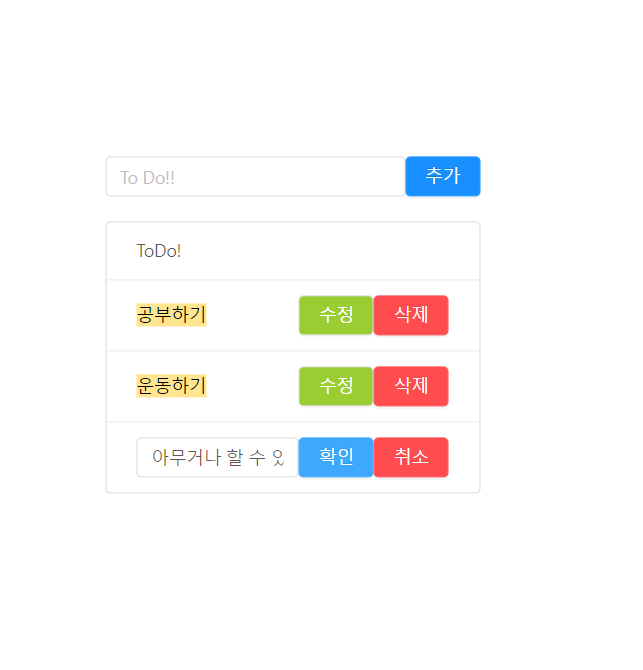
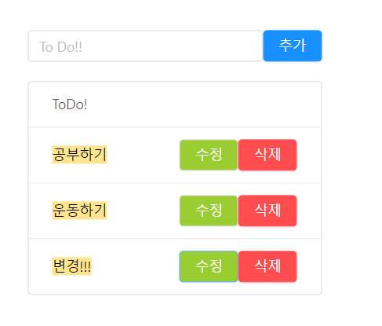
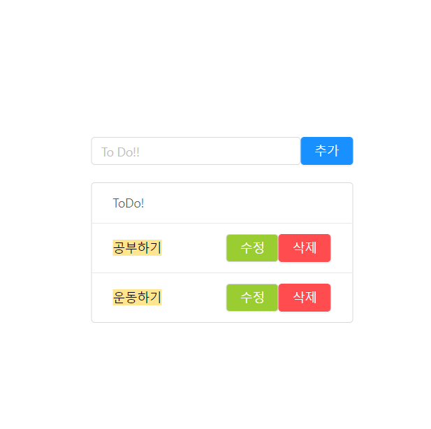
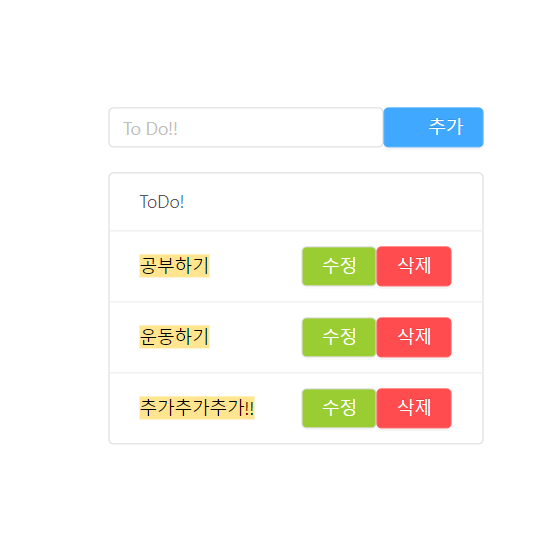

# 투두리스트 만들어보기

react, redux, redux-saga를 익혀보기 위해서 투두리스트를 만들어보며 연습했다.

굳이 리덕스, 리덕스사가를 안 써도 되지만 연습해보기 위해서 함.

사가에서는 delay로 api요청을 보내는 것처럼 해놨다.

### TODO 업데이트 창

### TODO 업데이트 끝

### TODO 삭제

### TODO 추가

